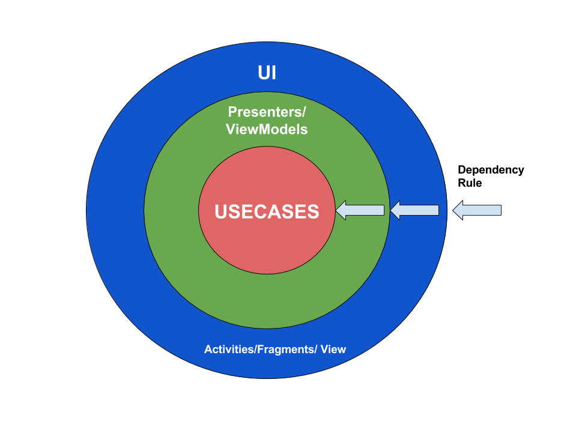
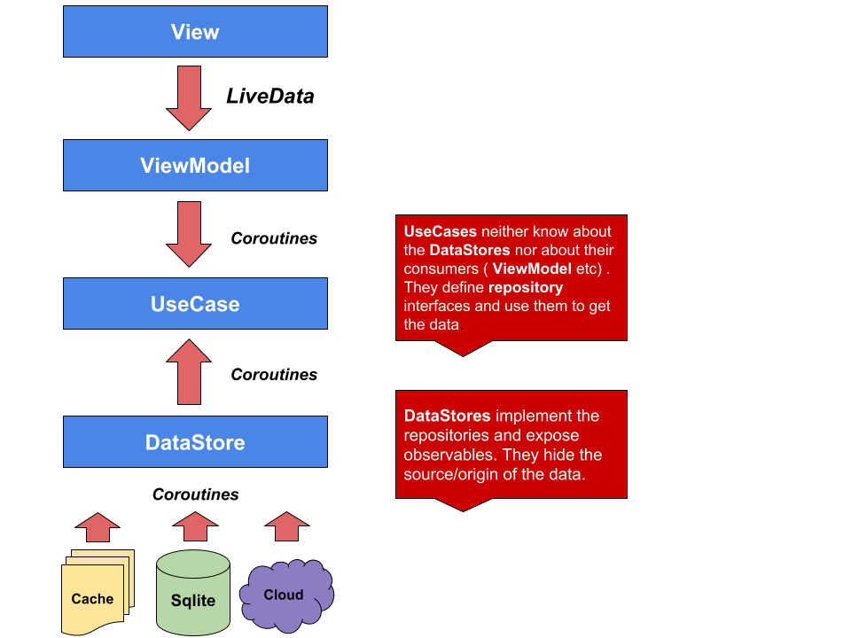

# WeatherAppClean

An Android Clean Architecture app with RxJava (end to end observables) written in Kotlin.

### Presentation Layer

The presentation layer was implemented using:

MVVM with ViewModels exposing Observables that the View consumes. The ViewModel does not know anything about it's consumers.
It exposes a single source of truth as an Observable for the consumers to subscribe and observe the events emitted. 
This events consist of entities, that are wrapped in a `Result` class that leverages the powerful Kotlin feature of sealed classes. 
This enables us to express the different states of the application's individual screens in an concise an expressive manner. 

### Domain Layer

The domain layer defines two interfaces for the specific UseCases to implement. Both expose RxJava types in their interface.
The `ObservableUseCase<in Params, Result>` should be used for business cases like the search example where a stream of events is needed and the `SingleUseCase<in Params, Result>` 
for business cases where a single object is sufficient.

### Data Layer

The data layer implements the repository interface that the domain layer defines. They provide a single source for data and hide the origin of the data.
This allows effective caching using a custom cache implementation or/and the Sqlite Db without polluting the other layers with the implementation details. 

## Clean architecture layers

<p align="center">
    
</p>

## Architecture overview and rules

<p align="center">
    
</p>


### Build Instructions

In order to run this project, you'll need to setup several things beforehand:

- This application uses the [OpenWeatherMap API](http://openweathermap.org) to obtain information about current weather and forecasts,
you'll need to register and obtain an API Key

- You'll need to set the values found in the [gradle.properties](gradle.properties) file.
This involves the OpenWeatherMap Api Key (`apiToken`)

### License

```
Copyright 2017 Alexandros Koufatzis.

Licensed under the Apache License, Version 2.0 (the "License");
you may not use this file except in compliance with the License.
You may obtain a copy of the License at

    http://www.apache.org/licenses/LICENSE-2.0

Unless required by applicable law or agreed to in writing, software
distributed under the License is distributed on an "AS IS" BASIS,
WITHOUT WARRANTIES OR CONDITIONS OF ANY KIND, either express or implied.
See the License for the specific language governing permissions and
limitations under the License.